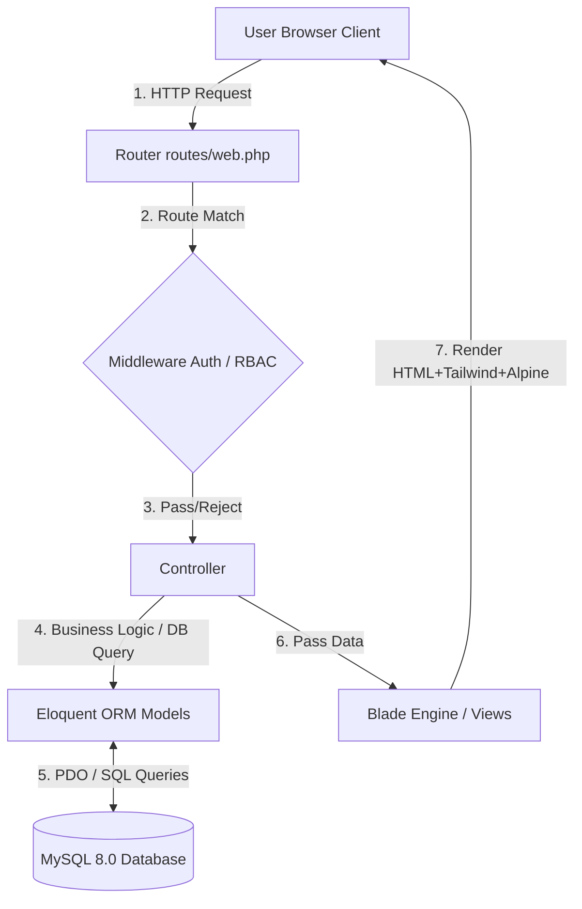
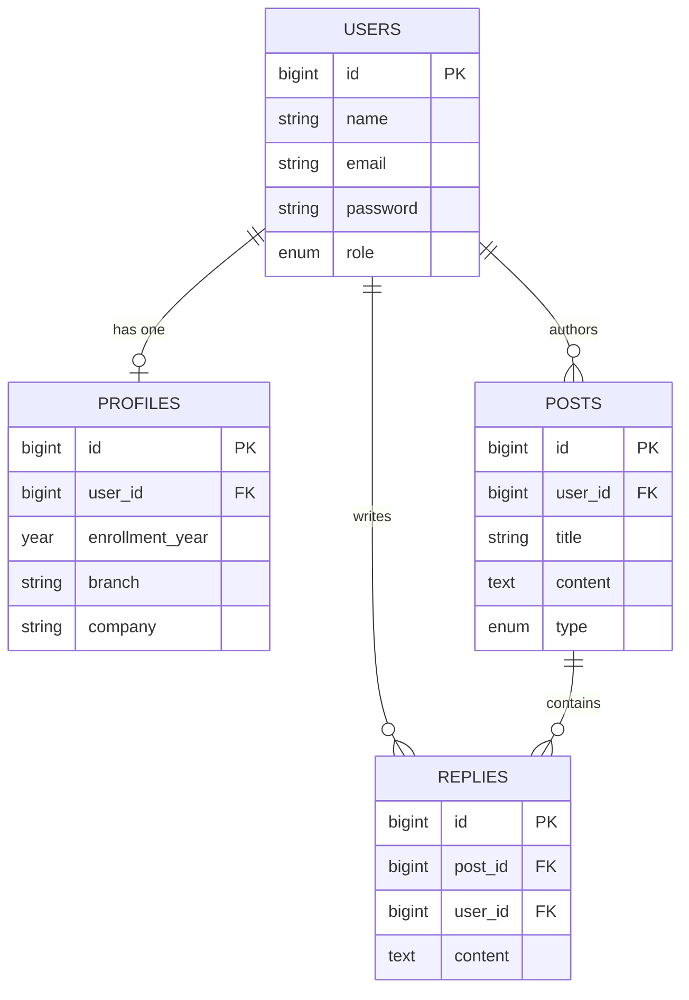

# System Architecture Document: KD Polytechnic Alumni Portal

**Role:** Principal Software Architect and Lead Systems Engineer  
**Project:** KD Polytechnic Alumni Portal  
**Document Version:** 1.0.0  

---

## SYSTEM OVERVIEW & ARCHITECTURAL PATTERN

The **KD Polytechnic Alumni Portal** is designed as a monolithic web application utilizing the **Model-View-Controller (MVC)** architectural pattern, strictly enforced by **Laravel 11**. 

By leveraging server-side rendering with **Laravel Blade**, enhanced with **Alpine.js** for lightweight client-side interactions and **Tailwind CSS** for modern, responsive styling, the platform strikes a balance between SEO-friendliness, performance, and developer ergonomics. The application employs **Laravel Breeze** for stateful session-based authentication and a custom HTTP Middleware layer for comprehensive Role-Based Access Control (RBAC).

---

## TECH STACK BREAKDOWN

### 1. Presentation Layer (Frontend)
- **Templating:** Laravel Blade Engine (Component-based layouts for reusable UI).
- **Styling:** Tailwind CSS (Utility-first CSS, compiled via Vite).
- **Client Interactivity:** Alpine.js (Handles dropdowns, modals, tab switching, and reactive states without the overhead of heavy SPA frameworks).
- **Formatting:** Lightweight frontend Markdown parser for the Code/Challenge Board to render formatted code snippets.

### 2. Application / Business Logic Layer (Backend)
- **Framework:** Laravel 11 running on PHP 8.2+.
- **Routing:** Centralized in `routes/web.php` for RESTful URL mapping.
- **Controllers:** Resource Controllers handling HTTP Request Validation, Business Logic, and Response Generation.
- **Middleware:** Custom Role Middleware (`CheckRole:Student`, `CheckRole:Alumni`, `CheckRole:Admin`) chained with Laravel's native Auth middleware.

### 3. Data Access & Persistence Layer (Database)
- **DBMS:** MySQL 8.0+.
- **ORM:** Eloquent ORM mapping database records to PHP objects.
- **Connection Strategy:** PDO (PHP Data Objects) utilizing parameterized queries for inherent SQL Injection mitigation.

### 4. Infrastructure & Hosting Environments
- **Local Development:** Laravel Artisan Dev Server (`php artisan serve`) with local MySQL (XAMPP/WAMP/Herd).
- **Production Environment:** Hostinger Shared Hosting (Apache Web Server, phpMyAdmin, sub-directory deployment at `kdpalumni.scrapeguru.com`).

---

## 1. System Context & Component Diagram

The following Mermaid diagram illustrates the request lifecycle, detailing how a user interacts with the system, and how the underlying components coordinate to fulfill the request.



---

## 2. Directory Structure Blueprint

Below is the structured file tree of the application, isolating the critical paths specifically customized for the Alumni Portal.

```text
kd-alumni-portal/
├── app/
│   ├── Http/
│   │   ├── Controllers/
│   │   │   ├── Auth/                     # Laravel Breeze Auth Controllers
│   │   │   ├── ChallengeBoardController.php # Handles Knowledge Feed & Coding Challenges
│   │   │   ├── DirectoryController.php      # Searchable Alumni/Student Directory
│   │   │   └── ProfileController.php        # User Profile Management
│   │   ├── Middleware/
│   │   │   └── CheckRole.php                # Custom RBAC Enforcer
│   ├── Models/
│   │   ├── Post.php
│   │   ├── Profile.php
│   │   ├── Reply.php
│   │   └── User.php
├── database/
│   └── migrations/
│       ├── 0001_create_users_table.php
│       ├── 0002_create_profiles_table.php
│       ├── 0003_create_posts_table.php
│       └── 0004_create_replies_table.php
├── resources/
│   ├── css/
│   │   └── app.css                   # Tailwind entry point
│   ├── js/
│   │   └── app.js                    # Alpine.js & Vite entry point
│   └── views/
│       ├── auth/                     # Login, Register, Password Reset
│       ├── components/               # Reusable Blade components (Cards, Modals)
│       ├── directory/                # Directory index and user cards
│       ├── feed/                     # Challenge/Knowledge feed views
│       └── layouts/                  # Main App Layout (Header, Footer, Nav)
├── routes/
│   ├── console.php
│   └── web.php                       # Core RESTful Routes
├── .env                              # Environment configuration (Local/Production)
├── package.json
└── vite.config.js                    # Vite bundler configuration
```

---

## 3. Database Architecture & Entity-Relationship Schema (ERD)

### Database Tables & Schema Constraints

**`users` Table** (Core Authentication)
| Column | Type | Constraints | Description |
|--------|------|-------------|-------------|
| `id` | BIGINT | Primary Key, Auto-increment | Unique identifier |
| `name` | VARCHAR(255) | Not Null | Full name of user |
| `email` | VARCHAR(255) | Unique, Not Null | Login identifier |
| `password` | VARCHAR(255) | Not Null | Bcrypt hashed password |
| `role` | ENUM | 'student', 'alumni', 'admin' | User authorization level |
| `timestamps` | TIMESTAMP | Not Null | `created_at`, `updated_at` |

**`profiles` Table** (Extended User Data)
| Column | Type | Constraints | Description |
|--------|------|-------------|-------------|
| `id` | BIGINT | Primary Key, Auto-increment | Unique identifier |
| `user_id` | BIGINT | Foreign Key -> users(id) | Maps to user |
| `enrollment_year` | YEAR | Not Null | Year of admission |
| `branch` | VARCHAR(100) | Not Null | e.g., Computer Engineering |
| `current_city` | VARCHAR(100) | Nullable | Current location |
| `company` | VARCHAR(150) | Nullable | Current employer (Alumni) |
| `higher_studies` | VARCHAR(150) | Nullable | University details (Alumni) |
| `timestamps` | TIMESTAMP | Not Null | `created_at`, `updated_at` |

**`posts` Table** (Knowledge Feed & Challenge Board)
| Column | Type | Constraints | Description |
|--------|------|-------------|-------------|
| `id` | BIGINT | Primary Key, Auto-increment | Unique identifier |
| `user_id` | BIGINT | Foreign Key -> users(id) | Author of the post |
| `title` | VARCHAR(255) | Not Null | Headline/Challenge Title |
| `content` | TEXT | Not Null | Body text (Markdown enabled) |
| `type` | ENUM | 'challenge', 'discussion' | Post categorization |
| `timestamps` | TIMESTAMP | Not Null | `created_at`, `updated_at` |

**`replies` Table** (Solutions & Discussions)
| Column | Type | Constraints | Description |
|--------|------|-------------|-------------|
| `id` | BIGINT | Primary Key, Auto-increment | Unique identifier |
| `post_id` | BIGINT | Foreign Key -> posts(id) | The thread being replied to |
| `user_id` | BIGINT | Foreign Key -> users(id) | Author of the reply |
| `content` | TEXT | Not Null | Solution or comment text |
| `timestamps` | TIMESTAMP | Not Null | `created_at`, `updated_at` |

### Entity-Relationship Diagram (ERD)



---

## 4. Data Flow & Request Lifecycle

**Scenario:** *A Student submits a solution to an Alumnus's coding challenge on the Knowledge Feed.*

1. **Client Action:** Student clicks "Submit Solution" via an Alpine.js-powered modal in the browser, triggering an HTTP `POST` request to `/challenges/12/replies`.
2. **Routing:** `routes/web.php` maps `/challenges/{post}/replies` to the `ReplyController@store` method.
3. **Middleware Gatekeeper:**
   - Standard `auth` middleware verifies the student's session token.
   - Custom `role:student,alumni` middleware validates that the user is allowed to interact with challenges.
   - Verify CSRF token (`@csrf`).
4. **Controller Processing:** 
   - `ReplyController` injects `Request` and validates inputs (`content` must not be empty).
   - Extracts the authenticated user's ID via `Auth::id()`.
5. **Database Transaction:**
   - Eloquent creates a new `Reply` model.
   - PDO safely binds the parameters (`post_id`, `user_id`, `content`) preventing SQL injection.
   - Record is inserted into the `replies` table.
6. **Response:** 
   - `ReplyController` redirects back to the post view: `return redirect()->route('challenges.show', $post->id)->with('success', 'Solution submitted!');`
7. **View Rendering:** Blade re-renders the challenge page, including the new reply, and Alpine.js clears/closes the submission modal.

---

## 5. Security Architecture

- **CSRF Protection:** Laravel automatically generates a CSRF token for each active user session. Every `POST`, `PUT`, `PATCH`, or `DELETE` Blade form includes the `@csrf` directive. Requests without matching tokens are rejected with a 419 Error.
- **Authentication & Session:** Session identifiers are securely persisted as HTTP-only cookies. Laravel Breeze implements Bcrypt password hashing by default; plain-text passwords never touch the database.
- **Input Sanitization & Injection Defense:** By utilizing Eloquent ORM exclusively, all database queries are processed via PDO parameter binding. User input is automatically sanitized before hitting the MySQL database.
- **Role-Based Access Control (RBAC):** Middleware operates at the routing level to restrict access. 

**Code Snippet: RBAC Middleware (`CheckRole.php`)**
```php
public function handle(Request $request, Closure $next, ...$roles)
{
    if (!Auth::check() || !in_array(Auth::user()->role, $roles)) {
        abort(403, 'Unauthorized access.');
    }
    return $next($request);
}
```

**Code Snippet: Route Application (`web.php`)**
```php
// Only Alumni and Admins can create new coding challenges
Route::post('/challenges', [ChallengeBoardController::class, 'store'])
     ->middleware(['auth', 'role:alumni,admin']);
```

---

## 6. Environment & Deployment Strategy

### Local Development Setup (Milestone 1)
1. **Clone & Install Dependencies:**
   ```bash
   composer install
   npm install
   ```
2. **Environment Configuration:**
   Copy `.env.example` to `.env` and set local database credentials:
   ```env
   DB_CONNECTION=mysql
   DB_HOST=127.0.0.1
   DB_PORT=3306
   DB_DATABASE=kdpalumni_local
   DB_USERNAME=root
   DB_PASSWORD=
   ```
3. **Key Generation & Migrations:**
   ```bash
   php artisan key:generate
   php artisan migrate --seed
   ```
4. **Run Servers:**
   ```bash
   php artisan serve    # Terminal 1
   npm run dev          # Terminal 2 (Vite Hot-Reload)
   ```

### Hostinger Deployment Pipeline (Production)
Deployment into a Shared Hosting sub-directory (`kdpalumni.scrapeguru.com`).

1. **Asset Compilation (Local):**
   Run `npm run build` locally to compile Tailwind and Alpine.js assets into the `public/build` directory.
2. **Database Migration (Hostinger):**
   - Create a MySQL Database and User in Hostinger's hPanel.
   - Export local database or run SSH migrations if available.
3. **Upload Codebase:**
   - Zip the project (excluding `node_modules` and `.git`).
   - Upload and extract into Hostinger's `public_html/kdpalumni` path.
4. **Production `.env` Configuration:**
   Set Hostinger-specific database variables and ensure `APP_ENV=production` and `APP_DEBUG=false`.
5. **Symlink / `.htaccess` Configuration:**
   Because shared hosting typically serves from `public_html`, redirect incoming requests to Laravel's `public/` directory by placing this `.htaccess` in the `kdpalumni` root directory:
   
   ```apache
   <IfModule mod_rewrite.c>
       RewriteEngine On
       RewriteRule ^(.*)$ public/$1 [L]
   </IfModule>
   ```
   *Note: Ensure appropriate folder permissions (755 for directories, 644 for files, and `storage/` & `bootstrap/cache/` are writable).*# System Architecture Document: KD Polytechnic Alumni Portal

**Role:** Principal Software Architect and Lead Systems Engineer  
**Project:** KD Polytechnic Alumni Portal  
**Document Version:** 1.0.0  

---

## SYSTEM OVERVIEW & ARCHITECTURAL PATTERN

The **KD Polytechnic Alumni Portal** is designed as a monolithic web application utilizing the **Model-View-Controller (MVC)** architectural pattern, strictly enforced by **Laravel 11**. 

By leveraging server-side rendering with **Laravel Blade**, enhanced with **Alpine.js** for lightweight client-side interactions and **Tailwind CSS** for modern, responsive styling, the platform strikes a balance between SEO-friendliness, performance, and developer ergonomics. The application employs **Laravel Breeze** for stateful session-based authentication and a custom HTTP Middleware layer for comprehensive Role-Based Access Control (RBAC).

---

## TECH STACK BREAKDOWN

### 1. Presentation Layer (Frontend)
- **Templating:** Laravel Blade Engine (Component-based layouts for reusable UI).
- **Styling:** Tailwind CSS (Utility-first CSS, compiled via Vite).
- **Client Interactivity:** Alpine.js (Handles dropdowns, modals, tab switching, and reactive states without the overhead of heavy SPA frameworks).
- **Formatting:** Lightweight frontend Markdown parser for the Code/Challenge Board to render formatted code snippets.

### 2. Application / Business Logic Layer (Backend)
- **Framework:** Laravel 11 running on PHP 8.2+.
- **Routing:** Centralized in `routes/web.php` for RESTful URL mapping.
- **Controllers:** Resource Controllers handling HTTP Request Validation, Business Logic, and Response Generation.
- **Middleware:** Custom Role Middleware (`CheckRole:Student`, `CheckRole:Alumni`, `CheckRole:Admin`) chained with Laravel's native Auth middleware.

### 3. Data Access & Persistence Layer (Database)
- **DBMS:** MySQL 8.0+.
- **ORM:** Eloquent ORM mapping database records to PHP objects.
- **Connection Strategy:** PDO (PHP Data Objects) utilizing parameterized queries for inherent SQL Injection mitigation.

### 4. Infrastructure & Hosting Environments
- **Local Development:** Laravel Artisan Dev Server (`php artisan serve`) with local MySQL (XAMPP/WAMP/Herd).
- **Production Environment:** Hostinger Shared Hosting (Apache Web Server, phpMyAdmin, sub-directory deployment at `kdpalumni.scrapeguru.com`).

---

## 1. System Context & Component Diagram

The following Mermaid diagram illustrates the request lifecycle, detailing how a user interacts with the system, and how the underlying components coordinate to fulfill the request.


---

## 2. Directory Structure Blueprint

Below is the structured file tree of the application, isolating the critical paths specifically customized for the Alumni Portal.

```text
kd-alumni-portal/
├── app/
│   ├── Http/
│   │   ├── Controllers/
│   │   │   ├── Auth/                     # Laravel Breeze Auth Controllers
│   │   │   ├── ChallengeBoardController.php # Handles Knowledge Feed & Coding Challenges
│   │   │   ├── DirectoryController.php      # Searchable Alumni/Student Directory
│   │   │   └── ProfileController.php        # User Profile Management
│   │   ├── Middleware/
│   │   │   └── CheckRole.php                # Custom RBAC Enforcer
│   ├── Models/
│   │   ├── Post.php
│   │   ├── Profile.php
│   │   ├── Reply.php
│   │   └── User.php
├── database/
│   └── migrations/
│       ├── 0001_create_users_table.php
│       ├── 0002_create_profiles_table.php
│       ├── 0003_create_posts_table.php
│       └── 0004_create_replies_table.php
├── resources/
│   ├── css/
│   │   └── app.css                   # Tailwind entry point
│   ├── js/
│   │   └── app.js                    # Alpine.js & Vite entry point
│   └── views/
│       ├── auth/                     # Login, Register, Password Reset
│       ├── components/               # Reusable Blade components (Cards, Modals)
│       ├── directory/                # Directory index and user cards
│       ├── feed/                     # Challenge/Knowledge feed views
│       └── layouts/                  # Main App Layout (Header, Footer, Nav)
├── routes/
│   ├── console.php
│   └── web.php                       # Core RESTful Routes
├── .env                              # Environment configuration (Local/Production)
├── package.json
└── vite.config.js                    # Vite bundler configuration
```

---

## 3. Database Architecture & Entity-Relationship Schema (ERD)

### Database Tables & Schema Constraints

**`users` Table** (Core Authentication)
| Column | Type | Constraints | Description |
|--------|------|-------------|-------------|
| `id` | BIGINT | Primary Key, Auto-increment | Unique identifier |
| `name` | VARCHAR(255) | Not Null | Full name of user |
| `email` | VARCHAR(255) | Unique, Not Null | Login identifier |
| `password` | VARCHAR(255) | Not Null | Bcrypt hashed password |
| `role` | ENUM | 'student', 'alumni', 'admin' | User authorization level |
| `timestamps` | TIMESTAMP | Not Null | `created_at`, `updated_at` |

**`profiles` Table** (Extended User Data)
| Column | Type | Constraints | Description |
|--------|------|-------------|-------------|
| `id` | BIGINT | Primary Key, Auto-increment | Unique identifier |
| `user_id` | BIGINT | Foreign Key -> users(id) | Maps to user |
| `enrollment_year` | YEAR | Not Null | Year of admission |
| `branch` | VARCHAR(100) | Not Null | e.g., Computer Engineering |
| `current_city` | VARCHAR(100) | Nullable | Current location |
| `company` | VARCHAR(150) | Nullable | Current employer (Alumni) |
| `higher_studies` | VARCHAR(150) | Nullable | University details (Alumni) |
| `timestamps` | TIMESTAMP | Not Null | `created_at`, `updated_at` |

**`posts` Table** (Knowledge Feed & Challenge Board)
| Column | Type | Constraints | Description |
|--------|------|-------------|-------------|
| `id` | BIGINT | Primary Key, Auto-increment | Unique identifier |
| `user_id` | BIGINT | Foreign Key -> users(id) | Author of the post |
| `title` | VARCHAR(255) | Not Null | Headline/Challenge Title |
| `content` | TEXT | Not Null | Body text (Markdown enabled) |
| `type` | ENUM | 'challenge', 'discussion' | Post categorization |
| `timestamps` | TIMESTAMP | Not Null | `created_at`, `updated_at` |

**`replies` Table** (Solutions & Discussions)
| Column | Type | Constraints | Description |
|--------|------|-------------|-------------|
| `id` | BIGINT | Primary Key, Auto-increment | Unique identifier |
| `post_id` | BIGINT | Foreign Key -> posts(id) | The thread being replied to |
| `user_id` | BIGINT | Foreign Key -> users(id) | Author of the reply |
| `content` | TEXT | Not Null | Solution or comment text |
| `timestamps` | TIMESTAMP | Not Null | `created_at`, `updated_at` |

### Entity-Relationship Diagram (ERD)


---

## 4. Data Flow & Request Lifecycle

**Scenario:** *A Student submits a solution to an Alumnus's coding challenge on the Knowledge Feed.*

1. **Client Action:** Student clicks "Submit Solution" via an Alpine.js-powered modal in the browser, triggering an HTTP `POST` request to `/challenges/12/replies`.
2. **Routing:** `routes/web.php` maps `/challenges/{post}/replies` to the `ReplyController@store` method.
3. **Middleware Gatekeeper:**
   - Standard `auth` middleware verifies the student's session token.
   - Custom `role:student,alumni` middleware validates that the user is allowed to interact with challenges.
   - Verify CSRF token (`@csrf`).
4. **Controller Processing:** 
   - `ReplyController` injects `Request` and validates inputs (`content` must not be empty).
   - Extracts the authenticated user's ID via `Auth::id()`.
5. **Database Transaction:**
   - Eloquent creates a new `Reply` model.
   - PDO safely binds the parameters (`post_id`, `user_id`, `content`) preventing SQL injection.
   - Record is inserted into the `replies` table.
6. **Response:** 
   - `ReplyController` redirects back to the post view: `return redirect()->route('challenges.show', $post->id)->with('success', 'Solution submitted!');`
7. **View Rendering:** Blade re-renders the challenge page, including the new reply, and Alpine.js clears/closes the submission modal.

---

## 5. Security Architecture

- **CSRF Protection:** Laravel automatically generates a CSRF token for each active user session. Every `POST`, `PUT`, `PATCH`, or `DELETE` Blade form includes the `@csrf` directive. Requests without matching tokens are rejected with a 419 Error.
- **Authentication & Session:** Session identifiers are securely persisted as HTTP-only cookies. Laravel Breeze implements Bcrypt password hashing by default; plain-text passwords never touch the database.
- **Input Sanitization & Injection Defense:** By utilizing Eloquent ORM exclusively, all database queries are processed via PDO parameter binding. User input is automatically sanitized before hitting the MySQL database.
- **Role-Based Access Control (RBAC):** Middleware operates at the routing level to restrict access. 

**Code Snippet: RBAC Middleware (`CheckRole.php`)**
```php
public function handle(Request $request, Closure $next, ...$roles)
{
    if (!Auth::check() || !in_array(Auth::user()->role, $roles)) {
        abort(403, 'Unauthorized access.');
    }
    return $next($request);
}
```

**Code Snippet: Route Application (`web.php`)**
```php
// Only Alumni and Admins can create new coding challenges
Route::post('/challenges', [ChallengeBoardController::class, 'store'])
     ->middleware(['auth', 'role:alumni,admin']);
```

---

## 6. Environment & Deployment Strategy

### Local Development Setup (Milestone 1)
1. **Clone & Install Dependencies:**
   ```bash
   composer install
   npm install
   ```
2. **Environment Configuration:**
   Copy `.env.example` to `.env` and set local database credentials:
   ```env
   DB_CONNECTION=mysql
   DB_HOST=127.0.0.1
   DB_PORT=3306
   DB_DATABASE=kdpalumni_local
   DB_USERNAME=root
   DB_PASSWORD=
   ```
3. **Key Generation & Migrations:**
   ```bash
   php artisan key:generate
   php artisan migrate --seed
   ```
4. **Run Servers:**
   ```bash
   php artisan serve    # Terminal 1
   npm run dev          # Terminal 2 (Vite Hot-Reload)
   ```

### Hostinger Deployment Pipeline (Production)
Deployment into a Shared Hosting sub-directory (`kdpalumni.scrapeguru.com`).

1. **Asset Compilation (Local):**
   Run `npm run build` locally to compile Tailwind and Alpine.js assets into the `public/build` directory.
2. **Database Migration (Hostinger):**
   - Create a MySQL Database and User in Hostinger's hPanel.
   - Export local database or run SSH migrations if available.
3. **Upload Codebase:**
   - Zip the project (excluding `node_modules` and `.git`).
   - Upload and extract into Hostinger's `public_html/kdpalumni` path.
4. **Production `.env` Configuration:**
   Set Hostinger-specific database variables and ensure `APP_ENV=production` and `APP_DEBUG=false`.
5. **Symlink / `.htaccess` Configuration:**
   Because shared hosting typically serves from `public_html`, redirect incoming requests to Laravel's `public/` directory by placing this `.htaccess` in the `kdpalumni` root directory:
   
   ```apache
   <IfModule mod_rewrite.c>
       RewriteEngine On
       RewriteRule ^(.*)$ public/$1 [L]
   </IfModule>
   ```
   *Note: Ensure appropriate folder permissions (755 for directories, 644 for files, and `storage/` & `bootstrap/cache/` are writable).*
